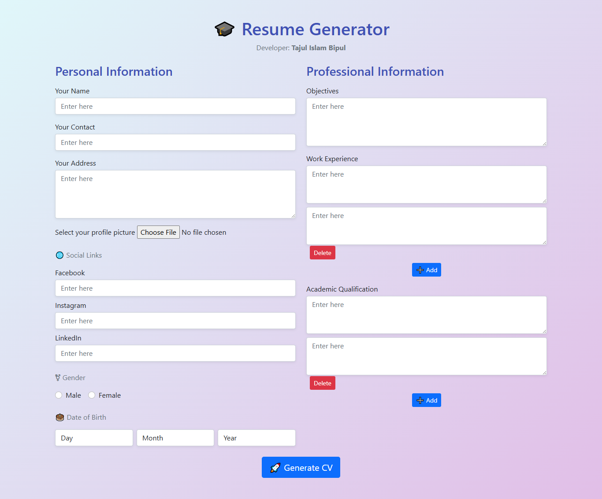

# 📄 Resume Generator

A simple **Resume Generator** built with **HTML, CSS, JavaScript, and Bootstrap**.  
This project allows users to easily create a professional-looking resume by filling out their personal details.

## ✨ Features
- Upload profile picture  
- Fill in personal details: **Name, Address, Gender, Date of Birth**  
- Add **Objectives, Work Experience, and Educational Qualification**  
- Auto-generate a formatted resume template  
- Option to **Print** or **Download as PDF**  
- Great for learning **JavaScript DOM manipulation & Bootstrap UI**  

## 🚀 Tech Stack
- HTML  
- CSS  
- JavaScript  
- Bootstrap  

## 📸 Screenshots
### Resume Form


### Resume Template


## 🌐 Live Demo
👉 [Click here to see the Resume Generator](https://bipul-dev01.github.io/cvgenerator/)

## 🎯 Learning Purpose
This project is helpful for beginners to learn:  
- JavaScript form handling  
- DOM manipulation  
- Bootstrap layout design  
- Generating dynamic printable content  

## 📥 Usage
1. Clone this repository  
   ```bash
   git clone https://github.com/bipul-dev01/cvgenerator.git
